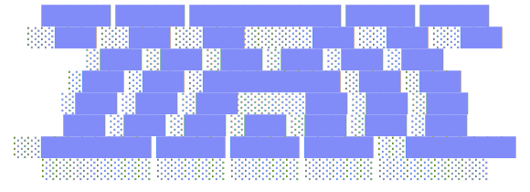

<div align="center">

<picture>
  <source media="(prefers-color-scheme: dark)" srcset=".github/assets/logo-dark.svg">
  <source media="(prefers-color-scheme: light)" srcset=".github/assets/logo-light.svg">
  
</picture>

**A terminal UI for Jira — browse sprints, transition issues, post comments, and search with JQL without leaving the terminal.**

[](https://go.dev/)
[](https://github.com/seanhalberthal/jiru/actions)
[](LICENCE)
[]()

[Quick Start](#quick-start) · [Configuration](#configuration) · [Usage](#usage) · [Keybindings](#keybindings) · [Development](#development)

</div>

---

## Features

- **Home screen** — board list with active sprint names and issue statistics
- **Sprint list view** — browse issues in the active sprint with filtering
- **Kanban board view** — status columns with card rendering, scrolling, and parent-based filtering
- **Issue detail view** — metadata, parent/child issue navigation, progress bar, description, and comments with full Atlassian wiki markup rendering
- **Inline issue actions** — assign (`a`), edit summary/priority (`e`), link issues (`l`), delete (`D`), and transition status (`m`) without leaving the terminal
- **Comments** — post comments from the issue detail view (`c`) with a multi-line editor
- **JQL search** — context-aware autocomplete for fields, operators, values, and keywords, with live user search for assignee/reporter
- **Saved filters** — save, edit, duplicate, favourite, and apply JQL queries from a filter manager (`f`), with copy-to-clipboard for JQL
- **Issue creation** — multi-step wizard to create issues with project/type pickers, priority, assignee search, labels, and parent issue
- **Branch creation** — create branches from issues with configurable mode (local, remote, or both) and title-case or lowercase naming
- **Issue key navigation** — jump between referenced issues (parent, children, description/comment links) via the issue picker (`i`)
- **Profiles** — multiple named profiles for different Jira instances, switchable with `--profile` or `P` in the TUI
- **CLI subcommands** — `get`, `search`, `list`, `boards` — JSON output for scripting and integration
- **Setup wizard** — interactive first-run configuration with API validation and OS keychain storage
- **Direct issue opening** — pass an issue key as a CLI argument to jump straight to it

---

## Quick Start

```sh
brew install seanhalberthal/tap/jiru
```

---

## Configuration

On first launch, if required credentials are missing, jiru shows an interactive setup wizard that validates credentials against the Jira API and stores the API token in the OS keychain (macOS Keychain or SecretService on Linux). Other settings are saved to `~/.config/jiru/profiles.yaml`. Re-open the wizard at any time with `S`.

### Profiles

jiru supports multiple named profiles for different Jira instances (e.g. work, staging). Use `--profile <name>` or `P` from the TUI to switch between profiles. Each profile stores its own credentials, project, board, and branch settings.

Configuration is resolved from four sources, in priority order:

1. **Environment variables** — always take precedence
2. **jiru profiles** — `~/.config/jiru/profiles.yaml` (written by the setup wizard)
3. **Zsh config files** — scans `~/.zshenv`, `~/.zprofile`, `~/.zshrc`, `~/.secrets.zsh`, `~/.config/secrets.zsh`, and `~/.config/zsh/secrets.zsh` for `export` statements
4. **jira-cli config** — falls back to `~/.config/.jira/.config.yml` for domain, user, and board ID

| Variable | Alias | Purpose | Required |
|---|---|---|---|
| `JIRA_DOMAIN` | `JIRA_URL` | Jira instance domain, e.g. `yourorg.atlassian.net` | Yes |
| `JIRA_USER` | `JIRA_USERNAME` | Atlassian email address | Yes |
| `JIRA_API_TOKEN` | | [API token](https://id.atlassian.com/manage-profile/security/api-tokens) or PAT | Yes |
| `JIRA_AUTH_TYPE` | | `basic` (default) or `bearer` | No |
| `JIRA_BOARD_ID` | | Board ID — skips the home screen when set | No |
| `JIRA_PROJECT` | | Project key to filter the board list | No |
| `JIRA_REPO_PATH` | | Path to local git repo for branch creation | No |
| `JIRA_BRANCH_UPPERCASE` | | `true` for Title-Case branch names (e.g. `PROJ-123-Fix-Login-Bug`) | No |
| `JIRA_BRANCH_MODE` | | Branch creation mode: `local`, `remote`, or `both` (default: `local`) | No |

The aliases (`JIRA_URL`, `JIRA_USERNAME`) provide compatibility with tools like mcp-atlassian that use different variable names. `JIRA_DOMAIN` strips the protocol automatically if provided.

<details>
<summary>Finding your board ID</summary>

The board ID is in the URL when viewing a board in Jira:

```
https://yourorg.atlassian.net/jira/software/projects/PROJ/boards/123
```

The board ID is `123`.

</details>

---

## Usage

```sh
jiru                    # Launch the TUI
jiru PROJ-123           # Open a specific issue directly
jiru --profile staging  # Use a named profile
jiru --version          # Print version
jiru --reset            # Reset all config and credentials
```

### CLI subcommands

```sh
jiru get PROJ-123       # Fetch issue details as JSON
jiru search "JQL query" # Search issues via JQL
jiru list               # List issues in active sprint
jiru boards             # List available boards
```

All CLI subcommands support `--profile` and output JSON to stdout.

When `JIRA_BOARD_ID` is set, the TUI loads the sprint view directly. Otherwise, the home screen shows a list of boards to choose from.

---

## Keybindings

### Navigation

| Key | Action |
|---|---|
| `j` / `↓` | Move down |
| `k` / `↑` | Move up |
| `d` / `u` | Half-page down / up |
| `g` / `G` | Jump to top / bottom |
| `h` / `l` | Move left / right (board columns) |
| `Enter` | Open / select |
| `Esc` | Back one level |
| `q` | Back one level (quit at top level) |
| `Ctrl+C` | Quit |
| `H` | Go to home screen |

### Global actions

| Key | Context | Action |
|---|---|---|
| `?` | Home / sprint / board | Search issues (JQL) with autocomplete |
| `f` | Home / sprint / board | Saved filters |
| `r` | Sprint / board / issue / search results | Refresh current view |
| `b` | Sprint / board | Toggle board / list view |
| `c` | Home / sprint / board | Create new issue |
| `S` | Home / sprint / board | Open setup wizard |
| `P` | Home / sprint / board | Switch profile |
| `/` | Sprint / board / search results | Filter current list |

### Issue view

| Key | Action |
|---|---|
| `o` | Open issue in browser |
| `x` | Copy issue URL to clipboard |
| `m` | Transition issue status |
| `c` | Add comment |
| `a` | Assign issue |
| `e` | Edit summary / priority |
| `n` | Create branch from issue |
| `l` | Link to another issue |
| `D` | Delete issue |
| `p` | Navigate to parent issue |
| `i` | Jump to referenced issue (parent, child, mentioned) |

Global keys are suppressed when text input is active (search, create, branch, comment, etc.).

---

## Development

```sh
make build       # Build binary → ./jiru
make test        # Run tests with race detector
make lint        # Run golangci-lint v2
make check       # Run all checks: fmt, tidy, vet, lint, test
make build-all   # Cross-compile for linux/darwin × amd64/arm64
make help        # Show all targets
```

---

## Licence

[MIT](LICENCE)
