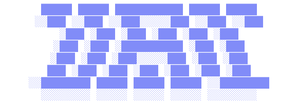

<div align="center">

<picture>
  <source media="(prefers-color-scheme: dark)" srcset=".github/assets/logo-dark.svg">
  <source media="(prefers-color-scheme: light)" srcset=".github/assets/logo-light.svg">
  
</picture>

**Terminal UI for Jira and Confluence. Browse sprints, transition issues, search with JQL, and read Confluence pages.**

[](https://github.com/seanhalberthal/jiru/actions)
[](https://github.com/seanhalberthal/jiru/releases/latest)
[](LICENCE)
[](https://go.dev)
[]()
[]()

[Quick Start](#quick-start) · [Configuration](#configuration) · [Usage](#usage) · [Keybindings](#keybindings) · [Development](#development)

</div>


---

## Features

- **Sprint list view** with filtering across the active sprint
- **Kanban board view** with status columns, card rendering, scrolling, and parent-based filtering
- **Issue detail view** showing metadata, progress, description, and comments rendered as Atlassian wiki markup, with parent/child navigation
- **Inline actions** to assign (`a`), transition (`m`), edit (`e`), link (`L`), unlink (`U`), and delete (`D`) issues; `e` covers summary, type, priority, story points, labels, fix versions, and description. Transition, link, and copy-URL also work from list, board, and search views
- **Comments** via a multi-line editor (`c`) on the issue detail view
- **JQL search** with context-aware autocomplete for fields, operators, values, and keywords, plus live user search for assignee/reporter
- **Saved filters** through a manager (`f`) for saving, editing, duplicating, favouriting, applying, and copying JQL queries
- **Issue creation** via a multi-step wizard covering project/type, priority, assignee search, labels, and parent issue
- **Branch creation** from an issue with configurable mode (local, remote, or both) and Title-Case or lowercase naming
- **Issue key navigation** between referenced issues (parent, children, description/comment links) via the picker (`i`)
- **Confluence integration** for browsing spaces, reading pages with full ADF rendering, viewing inline and footer comments, navigating page hierarchies, and revisiting recently viewed pages (`Tab`)
- **Profiles** for multiple Jira instances, switchable with `--profile` or `P` in the TUI
- **CLI subcommands** (`get`, `search`, `list`, `boards`, `wiki`) that emit JSON for scripting
- **Setup wizard** on first launch with API validation and OS keychain storage
- **Direct issue opening** by passing an issue key as a CLI argument

---

## Quick Start

```sh
brew install seanhalberthal/tap/jiru
```

---

## Configuration

On first launch, if required credentials are missing, jiru shows an interactive setup wizard that validates credentials against the Jira API and stores the API token in the OS keychain (macOS Keychain or SecretService on Linux). Other settings are saved to `~/.config/jiru/profiles.json`. Re-open the wizard at any time with `S`.

### Profiles

jiru supports multiple named profiles for different Jira instances (e.g. work, staging). Use `--profile <name>` or `P` from the TUI to switch between profiles. Each profile stores its own credentials, project, board, and branch settings.

Settings are stored in `$XDG_CONFIG_HOME/jiru/profiles.json` (defaults to `~/.config/jiru/`) and the API token is kept in the OS keychain. The setup wizard handles all of this automatically.

Environment variables can override profile settings when needed (e.g. for CI or scripting):

| Variable | Alias | Purpose |
|---|---|---|
| `JIRA_DOMAIN` | `JIRA_URL` | Jira instance domain, e.g. `yourorg.atlassian.net` |
| `JIRA_USER` | `JIRA_USERNAME` | Atlassian email address |
| `JIRA_API_TOKEN` | | [API token](https://id.atlassian.com/manage-profile/security/api-tokens) or PAT |
| `JIRA_AUTH_TYPE` | | `basic` (default) or `bearer` |
| `JIRA_BOARD_ID` | | Board ID; if unset, the setup wizard prompts for one |
| `JIRA_PROJECT` | | Project key to filter the board list |
| `JIRA_REPO_PATH` | | Path to local git repo for branch creation |
| `JIRA_BRANCH_UPPERCASE` | | `true` for Title-Case branch names (e.g. `PROJ-123-Fix-Login-Bug`) |
| `JIRA_BRANCH_MODE` | | Branch creation mode: `local`, `remote`, or `both` (default: `local`) |

The aliases (`JIRA_URL`, `JIRA_USERNAME`) provide compatibility with tools like mcp-atlassian that use different variable names. `JIRA_DOMAIN` strips the protocol automatically if provided.

<details>
<summary>Finding your board ID</summary>

The board ID is in the URL when viewing a board in Jira:

```
https://yourorg.atlassian.net/jira/software/projects/PROJ/boards/123
```

The board ID is `123`.

</details>

---

## Usage

```sh
jiru                    # Launch the TUI
jiru PROJ-123           # Open a specific issue directly
jiru --profile staging  # Use a named profile
jiru --demo             # Launch the in-memory demo (no real credentials needed)
jiru --version          # Print version
jiru --reset            # Reset all config and credentials
```

### CLI subcommands

```sh
jiru get PROJ-123       # Fetch issue details as JSON
jiru search "JQL query" # Search issues via JQL
jiru list               # List issues in active sprint
jiru boards             # List available boards
jiru wiki               # Confluence wiki commands
```

All CLI subcommands support `--profile` and output JSON to stdout.

When `JIRA_BOARD_ID` is set, the TUI loads the sprint view directly. Otherwise, the setup wizard prompts for a board. You can switch boards at any time with `B`.

---

## Keybindings

### Navigation

| Key | Action |
|---|---|
| `j` / `↓` | Move down |
| `k` / `↑` | Move up |
| `d` / `u` | Half-page down / up |
| `g` / `G` | Jump to top / bottom |
| `h` / `l` | Move left / right (board columns) |
| `Enter` / `Space` | Open / select |
| `Esc` | Back one level |
| `q` | Back one level (quit at top level) |
| `Ctrl+C` | Quit |

### Global actions

| Key | Context | Action |
|---|---|---|
| `s` | Most views | Search issues (JQL) with autocomplete |
| `?` | Most views | Help overlay |
| `f` | Sprint / board / search board | Saved filters |
| `r` | Sprint / board / issue / search results / search board | Refresh current view |
| `m` | Sprint / board / search results / search board | Transition issue status |
| `L` | Sprint / board / search results / search board | Link issue |
| `y` | Sprint / board / search results / search board / wiki | Copy issue or page URL |
| `b` | Sprint / board / search results / search board | Toggle board / list view |
| `B` | Sprint / board | Switch board |
| `c` | Sprint / board | Create new issue |
| `H` | Most views | Go home (issue list) |
| `S` | Sprint / board | Open setup wizard |
| `P` | Sprint / board | Switch profile |
| `Tab` | Sprint / board | Switch to Confluence wiki view |
| `/` | Sprint / board / search results / pickers | Filter current list |

### Issue view

| Key | Action |
|---|---|
| `o` | Open issue in browser |
| `y` | Copy issue URL to clipboard |
| `m` | Transition issue status |
| `c` | Add comment |
| `a` | Assign issue |
| `e` | Edit summary, type, priority, story points, labels, fix versions, description |
| `n` | Create branch from issue |
| `L` | Link to another issue |
| `U` | Unlink (remove an existing link) |
| `D` | Delete issue |
| `w` | Toggle watch / unwatch |
| `p` | Navigate to parent issue |
| `i` | Issue picker (parent, child, mentioned) |

Global keys are suppressed when text input is active (search, create, branch, comment, etc.).

---

## Development

```sh
make build       # Build binary → ./jiru
make test        # Run tests with race detector
make lint        # Run golangci-lint v2
make check       # Run all checks: fmt, tidy, vet, lint, test
make build-all   # Cross-compile for linux/darwin × amd64/arm64
make build-debug # Build with debug symbols (no -s -w, -gcflags='all=-N -l')
make debug       # Attach Delve headless to a running ./jiru (127.0.0.1:38697)
make demo        # Re-record .demo/demo.gif from .demo/demo.tape (needs vhs + ffmpeg)
make help        # Show all targets
```

---

## Licence

[MIT](LICENCE)
